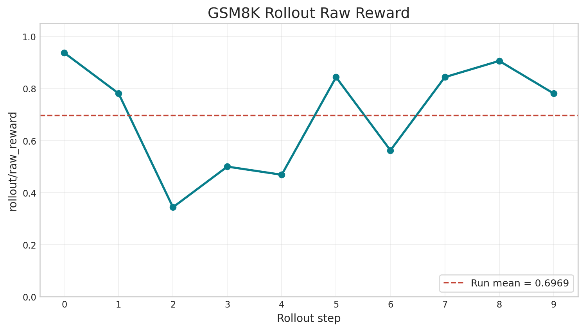
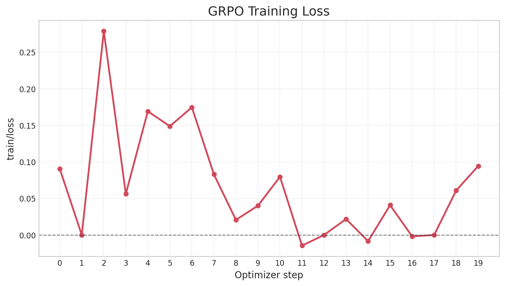

# Relax 新手入门任务实验报告

## 1. 基本信息

| 项目 | 填写内容 |
| --- | --- |
| 学校 / 专业 / 姓名 | 香港中文大学 / 人工智能 / 冯玉翔 |
| 完成日期 | 2026-07-24 |
| 代码分支 / commit id | task/issue-76 / 54f144fac518bd30277f686b185e3ad8103bf56e |
| GPU 型号与数量 | NVIDIA GeForce RTX 3090 Ti × 1（24 GiB） |
| Python / CUDA / 镜像版本 | Python 3.12.3 / CUDA 12.9（PyTorch 2.11.0+cu129） / `ghcr.io/redai-infra/relaxrl:dev-20260715-8325919e` |

## 2. 任务详情

| 项目 | 填写内容 |
| --- | --- |
| 模型 | Qwen3-0.6B |
| 数据集 | GSM8K（openai/gsm8k，训练集） |
| 算法 | GRPO |
| 实际训练步数 | 10 个 rollout/外层 training step；20 个 optimizer step（0–19） |
| 总耗时 | 约 18 分 13 秒（23:55:18–00:13:31） |
| 日志 / 输出目录 | `log/qwen3-0.6b-GRPO-gsm8k-1xgpu-2026-07-23-23:55:18.log`；`tensorboard_log/Relax/dev/beginner-task/qwen3-0.6b-GRPO-gsm8k-1xgpu-2026-07-23-23:55:18/events.out.tfevents.1784822168.docker-desktop.2318.0` |
| 主要参数调整 | 共 19 个运行配置修改，逐项原因、影响和验证结果见 2.1；完整脚本 diff 中另有 4 个仅影响说明/格式的修改，见 2.3。 |

### 2.1 启动脚本修改逐项说明

由于本次实验时，正好出差外地，手边暂无合适设备，因此新手任务暂只能使用低性能的显卡完成。为了完成新手任务，大部分配置必须降配。
以下内容共列出 19 个会影响运行配置的修改；这些修改都发生在任务启动脚本中，没有修改 Relax 框架核心实现。

#### 路径与训练规模

| # | 参数 | 原始值 | 当前值 | 调整原因、影响与验证 |
| --- | --- | --- | --- | --- |
| 1 | `MODEL_DIR` 默认值 | `/your/model` | `/models` | Docker 将宿主机模型目录挂载为 `/models`。因此Docker中从 `/models/Qwen3-0.6B` 加载模型。 |
| 2 | `DATA_DIR` 默认值 | `/your/data` | `/data` | Docker 将宿主机数据目录挂载为 `/data`。因此正式日志确认使用 `/data/gsm8k/main/train_clean.parquet`。 |
| 3 | `NUM_ROLLOUT` | `100` | `10` | 本任务只要求不少于 10 个 training step。当前 `4 × 8 / 16 = 2` 个 optimizer step/rollout，因此 10 个 rollout 实际产生 20 个 optimizer step，以确保达到任务要求。 |

#### Reward 并发与内存削峰

| # | 参数 | 原始值 | 当前值 | 调整原因、影响与验证 |
| --- | --- | --- | --- | --- |
| 4 | `--reward-num-workers` | `8` | `1` | 每个 RewardWorker 都是独立 Ray 进程，会占用额外 Python/解析库内存。此前发生过 WSL/Linux 系统 OOM，因此将 worker 数降为 1 以降低 host RAM 峰值；GSM8K 的本地 math reward 较轻，单 worker 足够完成本任务。代价是 reward 并行吞吐降低。 |
| 5 | `--reward-max-concurrency` | `8` | `2` | 限制同时进行的逐样本 reward 任务，降低临时对象、调度和 CPU 内存峰值，与单 worker 配套。代价是 reward 阶段可能变慢；正式运行的 10 个 rollout 均正常完成。 |

#### GPU、权重同步与重计算

| # | 参数 | 原始值 | 当前值 | 调整原因、影响与验证 |
| --- | --- | --- | --- | --- |
| 6 | `--max-tokens-per-gpu` | `8192` | `2048` | 该值限制动态训练 microbatch 的 token 预算。24 GiB RTX 3090 Ti 上曾在 Actor 前向阶段出现 CUDA OOM，因此降低到 2048 来减少激活和 logits 峰值。代价是 microbatch 数增加、训练速度下降。 |
| 7 | `--log-probs-max-tokens-per-gpu` | `8192` | `2048` | 单独限制 rollout/log-prob 计算阶段每张 GPU 的 token 预算，针对该阶段的大词表 logits 峰值。降低后会产生更多批次，但减少显存峰值。 |
| 8 | `--log-probs-chunk-size` | 未显式设置（默认 `-1`，不分块） | `4` | 此前在 `logits.clone()` 处尝试额外分配约 1.16 GiB 并 OOM。将 RL 的 post-logits log-prob reduce 分块执行可缩小临时张量；代价是增加分块循环和 kernel 调用。 |
| 9 | `--update-weight-buffer-size` | 未显式设置（框架默认 512 MiB） | `134217728`（128 MiB） | Actor 向 rollout/SGLang 同步权重时，框架按该阈值刷新 tensor bucket。缩小到 128 MiB 可降低权重 gather、转换和发送的 CPU/GPU 瞬时峰值；代价是刷新和传输次数增加。正式日志中最后一次权重更新全部返回 HTTP 200。 |
| 10 | `--train-memory-margin-bytes` | 未显式设置（框架默认 1 GiB） | `536870912`（512 MiB） | 24 GiB 显存下默认 1 GiB 保留量过于保守，而完全取消又缺少安全余量。改为 512 MiB，在增加约 512 MiB 可用空间的同时保留权重切换所需余量。日志中的 `TorchMemorySaver::malloc return OOM` 是越过 margin 时的受控拒绝，未传播为 `torch.OutOfMemoryError`。 |
| 11 | `--disable-weights-backuper` | 未设置（启用额外权重备份） | 已启用该禁用开关 | Relax 参数说明明确指出关闭 weights backuper 可节省 host memory；用于解决此前 Megatron Actor 被系统 OOM killer 杀死的问题。代价是减少一层本地权重备份/快速切换能力，但本次短程训练不依赖该能力。 |
| 12 | `--recompute-loss-function` | 未启用 | 启用 | 对 loss/log-prob 函数使用 activation checkpoint：前向少保留中间张量，反向时重新计算，直接针对 loss 阶段显存 OOM。代价是增加反向计算时间。 |
| 13 | `--recompute-granularity` | 未显式设置 | `full` | 指定对完整 Transformer layer 做 activation recompute，以获得更大的激活显存节省；代价是比 selective recompute 重算更多内容。 |
| 14 | `--recompute-method` | 未显式设置 | `uniform` | 将 28 层按均匀分组应用 checkpoint，避免只对局部 block 重计算造成显存峰值不均；代价是整个网络持续承担重算开销。 |
| 15 | `--recompute-num-layers` | 未显式设置 | `1` | 在 `full + uniform` 下将每 1 层作为一个重计算单元，优先获得更稳定、较低的激活峰值。代价是 checkpoint 边界和重计算次数更多。 |

#### GRPO 与指标后端

| # | 参数 | 原始值 | 当前值 | 调整原因、影响与验证 |
| --- | --- | --- | --- | --- |
| 16 | `--use-kl-loss` | 启用 | 注释，运行值为 `False` | 原脚本同时设置 `--kl-loss-coef 0.00`，KL 项本来就不会对最终 loss 产生数值贡献，但启用开关仍会要求 `ref_log_probs` 数据路径。关闭未生效的 KL loss 可减少不必要的参考策略计算/数据开销，算法仍为 GRPO。TensorBoard 中的 `train/ppo_kl` 只是诊断指标，仍正常记录。 |
| 17 | `--kl-loss-coef` | 显式 `0.00` | 注释，回到默认 `0.0` | 数值上没有改变优化目标；该行随 `--use-kl-loss` 一起注释，是为了避免报告误以为训练使用了 KL penalty。此项单独列出是为了完整对应脚本 diff。 |
| 18 | `--kl-loss-type` | `low_var_kl` | 注释，不生效 | KL loss 已关闭且系数为 0，因此 estimator 类型不会参与计算。注释该依赖参数可让实际配置更清楚；不会改变本次 GRPO 更新结果。 |
| 19 | `--use-clearml` | 启用 | 注释，运行值为 `False` | 正式实验改用本地 TensorBoard，避免依赖 ClearML 账号、网络上传以及多次调试产生的远端实验污染。`--use-metrics-service` 和 TensorBoard 配置仍保留，Reward/Loss/KL/grad norm 数据完整；代价是没有 ClearML 在线仪表盘。Issue #76 的必交材料是日志、PDF 与曲线，并未要求 ClearML 链接。 |

### 2.2 启动命令中其他显式值

以下值出现在完整启动命令中。前三项与原脚本默认值相同，不属于脚本 diff，但为了使步数计算和实验复现完整，仍明确记录其选择理由。

| 参数 | 值 | 设置原因与影响 |
| --- | --- | --- |
| `OMP_NUM_THREADS` | `8` | 原 `local.sh` 默认 24，而宿主机只有 16 个逻辑 CPU。降为 8 可避免 Ray 多进程叠加后的线程过量和 host RAM 压力；代价是部分 CPU 算子并行度降低。 |
| `MKL_NUM_THREADS` | `8` | 限制 MKL 每进程线程数，原因同上，避免多个 Ray worker 各自创建 24 条线程。 |
| `OPENBLAS_NUM_THREADS` | `8` | 限制 OpenBLAS 每进程线程数，原因同上；与 OMP/MKL 统一，避免底层库分别过度并行。 |
| `RAY_memory_usage_threshold` | `0.99` | 在 WSL 已扩容至约 27 GB RAM、16 GB swap 后，避免 Ray 在短时内存尖峰时过早杀死 worker。该值不会降低内存占用，且提高了接近 kernel OOM 的风险，因此必须与扩容和其他削峰参数一起使用。 |
| `NUM_GPUS` | `1` | 明确按任务要求使用单 GPU。 |
| `CUDA_VISIBLE_DEVICES` | `0` | 将任务固定到唯一的 RTX 3090 Ti，防止容器内设备选择变化影响复现。 |


完整启动命令：

```bash
cd /workspace/Relax
MODEL_DIR=/models \
DATA_DIR=/data \
NUM_ROLLOUT=10 \
ROLLOUT_BATCH_SIZE=4 \
N_SAMPLES=8 \
GLOBAL_BATCH_SIZE=16 \
OMP_NUM_THREADS=8 \
MKL_NUM_THREADS=8 \
OPENBLAS_NUM_THREADS=8 \
RAY_memory_usage_threshold=0.99 \
NUM_GPUS=1 \
CUDA_VISIBLE_DEVICES=0 \
bash examples/beginner-task/run-qwen3-0.6B-1xgpu-grpo.sh
```

## 3. 曲线图

### 3.1 Reward 曲线



指标名：`rollout/raw_reward`。数据来源：本次运行的 TensorBoard event 文件，共 10 个 rollout 点（0–9）；均值为 0.6969，首值 0.9375，末值 0.7812。本次短程实验用于验证链路，不据此声称模型已经收敛。

### 3.2 Loss 曲线



指标名：`train/loss`。数据来源：同一 TensorBoard event 文件，共 20 个 optimizer step 点（0–19）；首值 0.090547，末值 0.094228。GRPO policy loss 可为零或负值，不等同于监督学习中必须单调下降的交叉熵损失。


## 4. 遇到的问题与解决方案

| 问题现象 / 报错 | 原因分析 | 解决方案 | 如何确认已解决 |
| --- | --- | --- | --- |
| 新 shell 中出现 `/your/data/...` 不存在 | 容器内环境变量未继承，脚本占位默认路径不适合当前挂载 | 将可覆盖默认值设为 `/models`、`/data`，仍允许外部环境变量覆盖 | 正式日志从 `/models/Qwen3-0.6B` 加载模型，并读取 `/data/gsm8k/main/train_clean.parquet` |
| Actor 在 loss/log-prob 或前向阶段发生 CUDA OOM | 24 GiB GPU 上峰值 logits、激活和权重更新临时 buffer 同时占用显存 | token 上限降为 2048，log-prob chunk 设为 4；启用 loss/full recompute；设置 512 MiB margin 和 128 MiB update buffer；关闭 weights backuper | 最终日志无 `torch.OutOfMemoryError`，完成 optimizer step 0–19 |
| Megatron Actor 被系统 OOM killer 杀死 | WSL/容器内存与 swap 峰值不足，不是显卡显存问题 | WSL 配置约 27 GB 内存和 16 GB swap，并降低 reward 并发及权重更新峰值 | 容器可见约 26 GiB RAM、16 GiB swap；正式运行无 `ActorDiedError` 或全局重启 |
| `MetricsServiceAdapter` 因 `inf` 拒绝性能指标 | RTX 3090 Ti 未被 MFU 峰值表识别，`perf/device_peak_tflops=inf` 不能编码为严格 JSON | 保留日志并使用未受影响的 TensorBoard Reward/Loss/KL/grad norm；报告中明确披露缺失的 `perf/step_time` | event 文件含 10 个 Reward 点和 20 个 Loss/KL/grad-norm 点；训练结果未受影响 |

## 5. 总结

本次任务已完成 Qwen3-0.6B 在 GSM8K 上的单卡 GRPO 后训练，共完成 10 个 rollout/外层 training step 和 20 个 optimizer step。主链路为启动脚本完成参数解析，Controller 编排 Actor、Rollout 与 MetricsService，SGLang 生成回答，math reward 计算奖励，GRPO 估计优势并由 Megatron 更新策略，最后由 TensorBoard 记录指标。最终日志正常结束，Reward、Loss、KL 和 grad norm 曲线数据完整，满足不少于 10 个 training step 以及提交日志和训练曲线的要求。
